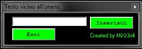
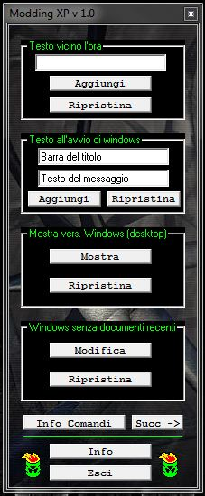
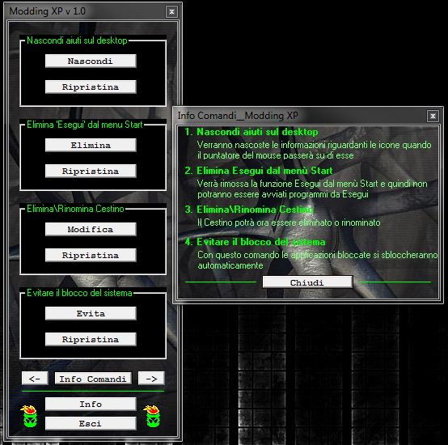
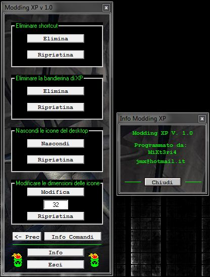

# Modding XP v 1.0 Build 7

ModdingXP is (among) my firsts attempts at writing an application that was actually doing something. I was 13. It was around the year 2003. No Stack Overflow, no Reddit.. Anything you're currently thinking of: Non-existent.

*18 years after*, I'm releasing its source code. Find it inside `src/`. The binary file for download is inside `bin/` but will also remain uploaded on [Mediafire](http://www.mediafire.com/?347gfwyfcwc7zcb) for until this website will remain on.

Lastly, I have also uploaded a `EXTRA` folder. Every note, every image, everything that helped me building `ModdingXP` is there. Well, not everything maybe, but this folder is still important to me.

Posted on July 14, 2012	 on juricalleri.net

---

`Modding XP` is the name I gave to my first real Windows application, written in `Visual Basic 6` and tested in Windows XP/Vista/7 but of course it was made with Windows XP in mind.

I was 13 when I wrote it, it all started when I discovered it was possibile to add a string beside the Windows clock, so I followed a tutorial I found to edit a system registry key, once done my name was beside the clock!

Honestly I liked it and and I thought I could write a program to automate this procedure.

  
  
  The "Alpha" version of `Modding XP` was called "testo vicino all'orario" (text next to the time, for not italians), it was a simple VB6 application with an input box and a button, whatever you wrote in it you could see next to the clock.   

   

I loved it more and more, it brought me to seek more Windows cheats who used the system registry to make funny and useful tricks.
I found many nice tricks, I wrote them on a text file and I started to write also the VB6 code for each of them.
The code was quite similar for almost all of them, except where I had to create arrays (such as "Windows flag").

It didn't take me much time writing the code, VB6 is mainly based on visual programming, I spent much time thinking to a "coloured" and stylish layout for the GUI.

After six Beta version and various tests I finally compiled the first and final version of Modding XP, the 1.0 build 7.

Years ago I also tried to publicize it so I gave the executable to a guy I met on a forum (I guess) who didn't publicized it on its website but at least he wrote me an email where he said that `Modding XP` helped a friend of him to fix some pc issues..
Did I create an antivirus and I didn"t even know?? (: I"m glad it helped but perhaps now it is time to publish it on my (cool) website!

Screenshoot (on Windows 7 because XP is too old) and download link here:

